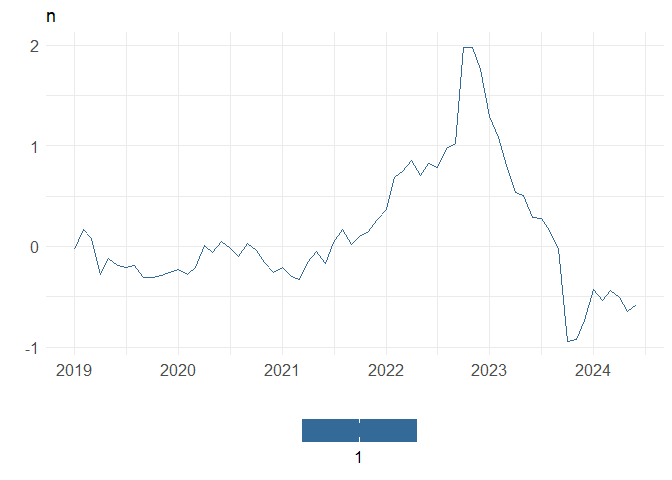

<!-- README.md is generated from README.Rmd. Please edit that file -->

# inflationinequality

<!-- badges: start -->

[](https://github.com/jeremimontornes/inflationinequality/actions/workflows/R-CMD-check.yaml)
<!-- badges: end -->

`inflationinequality` provides methods to calculate and visualize
inflation inequality indicators.

## Features

-   Calculate and visualize inflation and contributions to inflation by
    households categories
-   Simulate counterfactual price indices

## Example

Let’s visualize inflation inequality across income quintiles in Italy
since 2019.

``` r
library(inflationinequality)
inflation <- calculate_inflation("IT", "income", start_year = 2019)
#> There are some extra year months in dt_basket:
#>    year month
#> 1: 2024     7
#> There are some total consumption weights that are missing.
#>       These will be calculated as a simple average:
#>     coicop year
#>  1:    023 2010
#>  2:    023 2015
#>  3:    023 2020
#>  4:    063 2010
#>  5:    063 2015
#>  6:    081 2020
#>  7:    082 1988
#>  8:    082 1994
#>  9:    101 2010
#> 10:    102 2010
#> 11:    103 2010
#> 12:    103 2015
#> 13:    103 2020
#> 14:    122 2010
#> 15:    122 2015
#> 16:    122 2020
#> 17:    124 1994
#> 18:    124 1999
#> 19:    124 2010
#> 20:    126 2010
#> 21:    126 2015
#> 22:    126 2020
#>     coicop year
#> The following COICOP codes, found in HBS data, are removed for not being included in CPI data: 023, 042, 082, 083, 122
#> There are weights that are very large (>=20%):
#>     coicop        category weight_year year weighted_consumption
#>  1:    011  First quintile        2017 1999             22.44606
#>  2:    011  First quintile        2018 1999             22.42294
#>  3:    011  First quintile        2019 1999             22.16263
#>  4:    011  First quintile        2020 1999             22.09295
#>  5:    011  First quintile        2021 1999             25.68092
#>  6:    011 Second quintile        2021 1999             22.93381
#>  7:    011  Third quintile        2021 1999             21.37958
#>  8:    011  First quintile        2022 1999             24.42279
#>  9:    011 Second quintile        2022 1999             21.78811
#> 10:    011  Third quintile        2022 1999             20.16477
#> calculating contributions [===>-----------------]  17% eta:  8s (elapsed:  2s)calculating contributions [======>--------------]  33% eta:  6s (elapsed:  3s)calculating contributions [=========>-----------]  50% eta:  5s (elapsed:  5s)calculating contributions [=============>-------]  67% eta:  3s (elapsed:  6s)calculating contributions [=================>---]  83% eta:  2s (elapsed:  8s)calculating contributions [=====================] 100% eta:  0s (elapsed:  9s)
plot_inflation_gap(inflation)
```


