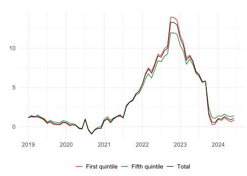


<!-- README.md is generated from README.Rmd. Please edit that file -->

# inflationinequality

<!-- badges: start -->

[](https://github.com/jeremimontornes/inflationinequality/actions/workflows/R-CMD-check.yaml)
<!-- badges: end -->

`inflationinequality` provides methods to calculate and visualize
inflation inequality indicators.

## Features

-   Calculate and visualize inflation and contributions to inflation by
    households categories
-   Simulate counterfactual price indices

## Example

Let us visualize inflation inequality across income quintiles in Italy since 2019.

``` r
library(inflationinequality)
inflation <- calculate_inflation("IT", "income", start_year = 2019)
plot_time_series(inflation)
```




