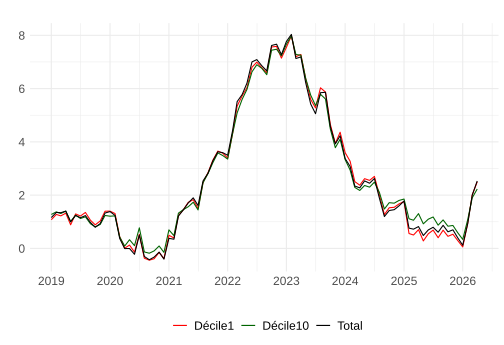

<!-- README.md is generated from README.Rmd. Please edit that file -->

# inflationinequality

<!-- badges: start -->

[](https://github.com/jeremimontornes/inflationinequality/actions/workflows/R-CMD-check.yaml) <!-- badges: end -->

`inflationinequality` provides methods to calculate and visualize inflation inequality indicators.

Package version: `0.0.2`

## Features

- Calculate and visualize inflation and contributions to inflation by households categories
- Calculate inflation burden as a share of disposable income
- Simulate counterfactual price indices

## Methodological workflow

The main workflow is:

`load_*()` -\> `calculate_weights()` -\> `calculate_price_indices()` / `calculate_inflation()` -\> `calculate_contributions()` -\> plots / validation.

## Example

Let us visualize inflation inequality across income quintiles in France since 2019, using the France level 3 COICOP workflow.

``` r
library(inflationinequality)
inflation <- calculate_inflation("FR", "income", start_year = 2019, level = 3,
                                 france_insee_income_groups = "quintile")
plot_time_series(inflation)
```



Source: Eurostat and national statistical institutes, HICP-HBS. Note: year-on-year change

## Vignettes

The introduction vignette walks through the package methodology, core functions, and plotting helpers:

- [Introduction to inflationinequality](https://jeremimontornes.github.io/inflationinequality/articles/inflationinequality-intro.html)
- [Advanced options](https://jeremimontornes.github.io/inflationinequality/articles/advanced-options.html)
- [Using national data](https://jeremimontornes.github.io/inflationinequality/articles/using-custom-data.html)
- [Calculating inflation burden](https://jeremimontornes.github.io/inflationinequality/articles/inflation-burden.html)
- [Verifications](https://jeremimontornes.github.io/inflationinequality/articles/verifying-calculated-inflation.html)

## Methodological metadata

The table below summarises the main methodological choices currently made by the package and identifies which choices users can override. It is intended as a living reference for handling country-specific cases.

<small>
<table>

<thead>

<tr>

<th style="text-align:left;">

topic
</th>

<th style="text-align:left;">

package_default
</th>

<th style="text-align:left;">

user_parameter
</th>

<th style="text-align:left;">

user_can_change
</th>

<th style="text-align:left;">

notes
</th>

</tr>

</thead>

<tbody>

<tr>

<td style="text-align:left;">

Default population groups
</td>

<td style="text-align:left;">

income quintiles for category = 'income'; age groups for category = 'age'; rural/town/city for category = 'urban'.
</td>

<td style="text-align:left;">

category argument, or custom_hbs with a custom ordered categories vector.
</td>

<td style="text-align:left;">

Yes
</td>

<td style="text-align:left;">

The ordered categories vector controls which groups are treated as bottom and top.
</td>

</tr>

<tr>

<td style="text-align:left;">

COICOP level
</td>

<td style="text-align:left;">

COICOP 3 digits by default (package level = 2); COICOP 2 to 4 digits are accepted by load and calculation functions.
</td>

<td style="text-align:left;">

level argument.
</td>

<td style="text-align:left;">

Yes
</td>

<td style="text-align:left;">

Eurostat HBS income data are generally available at 3-digit COICOP (package level = 2), which is the package default.
</td>

</tr>

<tr>

<td style="text-align:left;">

HBS-to-CPI timing
</td>

<td style="text-align:left;">

HBS waves are not available for all countries in the same years. For each CPI weight year, the package uses the closest available HBS wave at or before that year; if no earlier wave exists, it uses the earliest available HBS wave.
</td>

<td style="text-align:left;">

specific_hbs_year, interpolated_hbs, or custom_hbs/custom_index_weights.
</td>

<td style="text-align:left;">

Yes
</td>

<td style="text-align:left;">

This temporal merge is country-specific because Eurostat HBS waves differ across countries. Users can force a wave with specific_hbs_year, interpolate waves with interpolated_hbs = TRUE, or provide custom_hbs/custom_index_weights.
</td>

</tr>

<tr>

<td style="text-align:left;">

HBS interpolation
</td>

<td style="text-align:left;">

No interpolation by default.
</td>

<td style="text-align:left;">

interpolated_hbs = TRUE.
</td>

<td style="text-align:left;">

Yes
</td>

<td style="text-align:left;">

Useful when HBS waves are sparse and users want smoother weights over time.
</td>

</tr>

<tr>

<td style="text-align:left;">

Specific HBS wave
</td>

<td style="text-align:left;">

No single HBS wave is forced by default.
</td>

<td style="text-align:left;">

specific_hbs_year.
</td>

<td style="text-align:left;">

Yes
</td>

<td style="text-align:left;">

Useful for sensitivity analysis or reproducing a fixed-wave methodology.
</td>

</tr>

<tr>

<td style="text-align:left;">

Incomplete CPI coverage
</td>

<td style="text-align:left;">

Missing CPI series are not synthesised by default.
</td>

<td style="text-align:left;">

ensure_complete_cpi = TRUE.
</td>

<td style="text-align:left;">

Yes
</td>

<td style="text-align:left;">

Synthesised CPI data use parent-category price movements.
</td>

</tr>

<tr>

<td style="text-align:left;">

Inflation aggregation
</td>

<td style="text-align:left;">

Inflation is computed from COICOP contributions using annual HICP weights adjusted by HBS relative expenditure shares.
</td>

<td style="text-align:left;">

custom_cpi, custom_index_weights, custom_hbs, level, and date arguments.
</td>

<td style="text-align:left;">

Yes
</td>

<td style="text-align:left;">

</td>

</tr>

</tbody>

</table>

</small>

### Country-specific COICOP data caveats

Country coverage follows the Eurostat Statistics Explained article on [Household budget survey - statistics on consumption expenditure](https://ec.europa.eu/eurostat/statistics-explained/index.php?title=Household_budget_survey_-_statistics_on_consumption_expenditure&stable=1) and the harmonised Eurostat category tables returned by `load_hbs()`. Eurostat HBS income quintiles are household groups ranked by income; the HBS values are consumption expenditure or expenditure shares for households in each quintile, not average income. Ireland and Portugal responded to the 2020 HBS wave, with fieldwork in 2022-2023. Cyprus, France, and Malta 2020 HBS statistics are compiled from 2015-2017 data adjusted to the 2020 reference-year price level.

<small>

| country | coicop_case | population_group_caveat | package_status |
|---|---|---|---|
| France | Level = 3 uses bundled INSEE Budget de famille 2017 HBS at 4-digit COICOP for income, age, and residence-area groups. | National groups may differ from harmonised Eurostat groups; income can be used as deciles or adjacent-decile quintiles. | Implemented for level = 3 income, age, and urban calculations. |
| Italy | Income level = 2 uses reconstructed income-quintile baskets from Istat microdata and Eurostat all-households totals. | Italy income groups are estimated ventilations, not directly disseminated Eurostat income-quintile HBS tables. | Implemented for level = 2 income calculations. |
| Spain | Level = 3 uses compact INE EPF 2020 microdata-derived HBS objects for income, age, and residence-area groups. | Spain groups use equivalised income, reference-person age, and density of residence from EPF microdata. | Implemented for level = 3 income, age, and urban calculations. |
| Euro area | Euro-area aggregates are built from country-level HICP-HBS calculations and Eurostat HICP country weights. | Household groups are defined within each country; euro-area results are not a pooled household distribution. | Implemented through country-level calculations; unavailable inputs are excluded. |

</small>

## COICOP bridge HTML tables

- [France HICP-HBS bridge, income level 2](https://jeremimontornes.github.io/inflationinequality/france_coicop_hicp_hbs_bridge_income_level2_2010_2026.html)
- [France HICP-HBS bridge audit, income level 2](https://jeremimontornes.github.io/inflationinequality/france_coicop_hicp_hbs_bridge_income_level2_2010_2026_audit.html)
- [France HICP-HBS bridge, INSEE income level 3](https://jeremimontornes.github.io/inflationinequality/france_coicop_hicp_hbs_bridge_income_level3_insee_2010_2026.html)
- [France HICP-HBS bridge audit, INSEE income level 3](https://jeremimontornes.github.io/inflationinequality/france_coicop_hicp_hbs_bridge_income_level3_insee_2010_2026_audit.html)
- [France ECOICOP v2 to COICOP v1 level 3 audit](https://jeremimontornes.github.io/inflationinequality/france_hicp_ecoicopv2_to_coicopv1_level3_audit.html)
