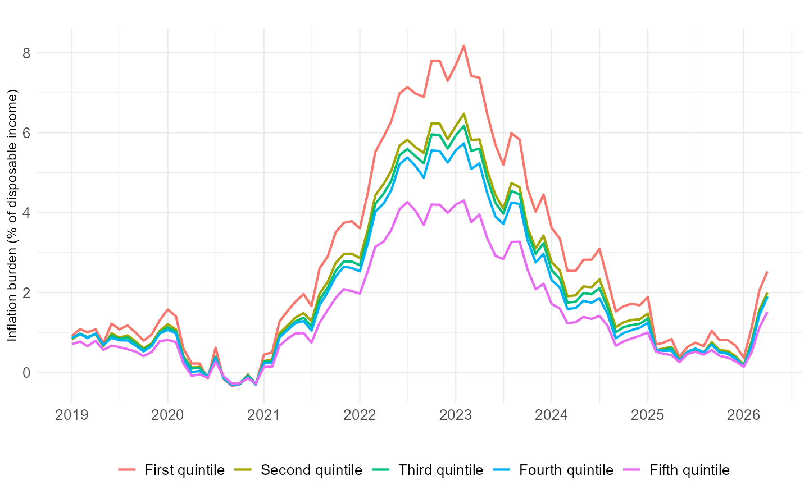
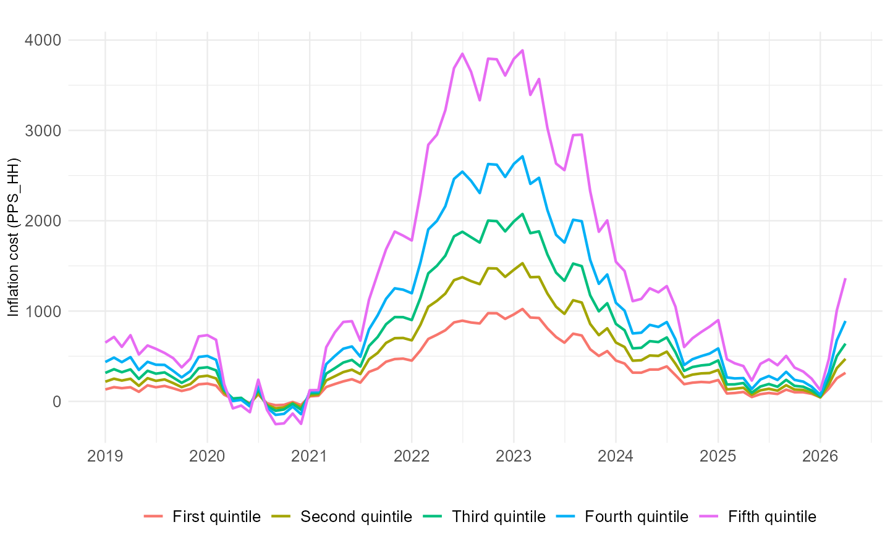

---
title: "Calculating inflation burden"
output: rmarkdown::html_vignette
vignette: >
  %\VignetteIndexEntry{Calculating inflation burden}
  %\VignetteEngine{knitr::rmarkdown}
  %\VignetteEncoding{UTF-8}
---

```{r, include = FALSE}
knitr::opts_chunk$set(
  collapse = TRUE,
  comment = "#>",
  eval = FALSE,
  warning = FALSE,
  message = FALSE
)
```

```{r setup, include = FALSE, eval = TRUE}
library(inflationinequality)
```

This vignette explains how to calculate an inflation burden indicator with `inflationinequality`.

The indicator follows a general cost-burden logic: a price shock is not only measured as an inflation rate, but also as an additional cost relative to household resources. In this package, the burden is expressed as a percentage of disposable income.

***

## Concept

Group-specific inflation rates answer the question:

> How fast are the prices of the consumption basket of group \(g\) increasing?

Inflation burden answers a slightly different question:

> How large is the inflation cost for group \(g\), relative to disposable income?

This distinction matters because two groups can face similar inflation rates but have different consumption-to-income ratios. A group that consumes a larger share of its disposable income can face a higher burden from the same inflation rate.

## Data sources

The default Eurostat workflow uses:

1. HICP prices and HICP item weights, loaded with `load_cpi()` and `load_index_weights()`.
2. Household Budget Survey (HBS) expenditure shares by income quintile, loaded with `load_hbs()`.
3. Eurostat experimental statistics `icw_sr_10`, aggregate propensity to consume by income quintile, loaded with `load_consumption_to_income()`.
4. Eurostat HBS table `hbs_exp_t133`, mean consumption expenditure by income quintile, loaded with `load_consumption_expenditure()`.

The Eurostat references are:

- [Eurostat `icw_sr_10`](https://ec.europa.eu/eurostat/databrowser/view/icw_sr_10/default/table): aggregate propensity to consume by income quintile, expressed as a percentage of disposable income.
- [Eurostat `hbs_exp_t133`](https://ec.europa.eu/eurostat/databrowser/view/hbs_exp_t133/default/table): mean consumption expenditure by income quintile, available in PPS per household or PPS per adult equivalent.

For the Lowe/Törnqvist comparison and the notion of upper-level substitution bias, see the BLS article [Examining U.S. inflation across households grouped by equivalized income](https://www.bls.gov/opub/mlr/2024/article/examining-us-inflation-across-households-grouped-by-equivalized-income.htm).

## Formula

Let:

- \(\pi^{y,m}_g\) be the year-on-year inflation rate for group \(g\) in year \(y\) and month \(m\), computed by `calculate_inflation()`.
- \(c^Y_g\) be the aggregate propensity to consume of group \(g\) in annual source year \(Y\), expressed as a percentage of disposable income.
- \(E^Y_g\) be mean consumption expenditure of group \(g\) in annual source year \(Y\), for example in PPS per household.

The inflation burden is:

$$
Burden^{y,m}_g = \pi^{y,m}_g \times \frac{c^Y_g}{100}
$$

where \(Burden^{y,m}_g\) is measured in percentage points of disposable income.

When expenditure data are available, the inflation cost is:

$$
Cost^{y,m}_g = E^Y_g \times \frac{\pi^{y,m}_g}{100}
$$

where \(Cost^{y,m}_g\) is measured in the same unit as \(E^Y_g\), for example PPS per household.

## Timing convention

The package matches annual burden inputs to monthly inflation using the latest available annual source year not later than the inflation year.

For example, if Eurostat reports `icw_sr_10` values for 2015 and 2020:

- monthly inflation in 2019 uses the 2015 value;
- monthly inflation in 2020 and later uses the 2020 value until a more recent source year is available.

This mirrors the package's general approach to sparse household survey waves: use the most recent household information available at the time of the price observation.

## France example

First calculate group-specific inflation by income quintile:

```{r}
inflation_fr <- calculate_inflation(
  "FR",
  "income",
  level = 2,
  start_year = 2019
)
```

Then calculate the inflation burden:

```{r}
burden_fr <- calculate_inflation_burden(
  inflation_fr,
  expenditure_unit = "PPS_HH"
)

head(burden_fr$dt)
```

The result is an object of class `"inflation_burden"`. Its `dt` component includes:

- `inflation`: group-specific inflation rate.
- `consumption_to_income`: consumption as a percentage of disposable income.
- `inflation_burden`: inflation cost as a percentage of disposable income.
- `expenditure`: mean consumption expenditure, if requested.
- `inflation_cost`: inflation cost in the expenditure unit, if requested.
- `consumption_to_income_year` and `expenditure_year`: source years used for the annual burden inputs.

## Plotting inflation burden

The default plot shows the burden in percentage points of disposable income:

```{r}
plot_inflation_burden(burden_fr)
```

```{r burden-income-share-figure, echo = FALSE, eval = TRUE, out.width = "100%"}

```

If expenditure was included, the same object can be plotted as an inflation cost:

```{r}
plot_inflation_burden(burden_fr, measure = "cost")
```

```{r burden-cost-figure, echo = FALSE, eval = TRUE, out.width = "100%"}

```

## Custom data

Users can also supply their own consumption-to-income ratios. This is useful when using national sources, survey microdata, or groups other than Eurostat income quintiles.

```{r}
custom_ratio <- data.table::data.table(
  category = c("First quintile", "Fifth quintile"),
  year = c(2020, 2020),
  consumption_to_income = c(114.1, 55.3)
)

burden_custom <- calculate_inflation_burden(
  inflation_fr,
  consumption_to_income = custom_ratio,
  include_expenditure = FALSE
)
```

The required columns are:

- `category`: group label matching `inflation$categories`.
- `year`: annual source year.
- `consumption_to_income`: consumption as a percentage of disposable income.

If expenditure is supplied, it must contain:

- `category`
- `year`
- `expenditure`

## Interpretation

An inflation burden of 4 means that the estimated inflation cost for that group is equal to 4 percent of disposable income over the relevant annual inflation window.

This should be read as a burden indicator, not as a direct welfare measure. It depends on the inflation measure, the consumption-to-income ratio, the household survey source year, and the assumption that annual consumption-to-income ratios can be used for monthly inflation observations until a newer source is available.
