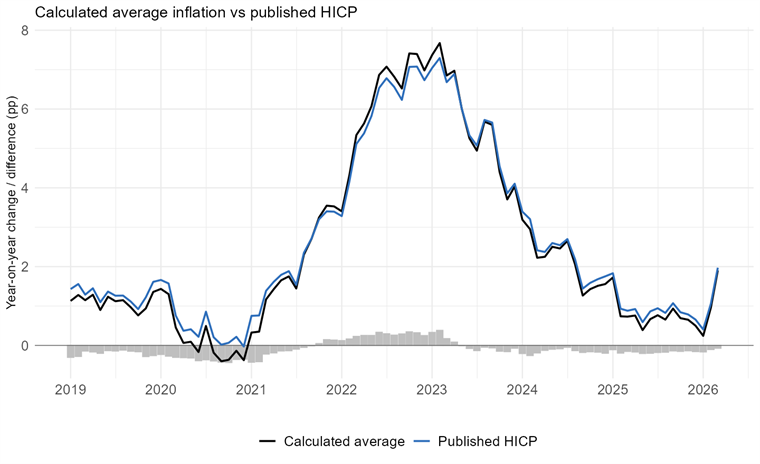
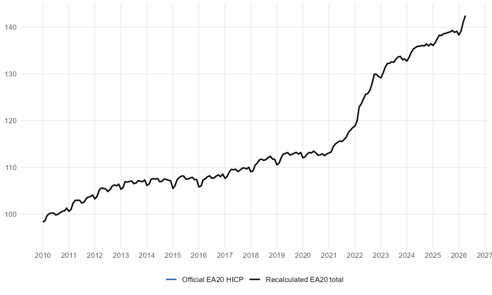

```{r, include = FALSE}
knitr::opts_chunk$set(
  collapse = TRUE,
  comment = "#>",
  echo = FALSE,
  warning = FALSE,
  message = FALSE,
  fig.width = 8,
  fig.height = 5
)
```

This appendix assesses whether the reconstructed inflation indices reproduce
the relevant official benchmarks with sufficient accuracy for distributional
analysis. Household-group indices combine official item prices and aggregate
expenditure weights with group-specific consumption baskets. The validation
therefore concerns the magnitude and persistence of the residual difference
between reconstructed and published indices.

Three checks are reported. First, the aggregation identity is evaluated on the
matched COICOP product field. Second, the French reconstruction is compared
with the published all-items HICP in both annual inflation rates and index
levels. Third, the French decile indices are compared with INSEE's published
indices by standard-of-living decile.

Small discrepancies may remain because the reconstruction relies on public
price and expenditure statistics rather than the full production files of
statistical institutes.

***

## Aggregation Identity

The income-quintile baskets are calibrated so that each basket sums to 100
percent and the simple average of the five baskets reproduces the official item
weights on the matched COICOP field. Before chain-linking, the average of the
five quintile-specific monthly movements is equal, up to numerical precision,
to the aggregate movement computed on the same product field. Remaining gaps
with the published all-items HICP therefore reflect coverage and source-data
differences rather than the aggregation formula.

## France All-Items HICP

The first external validation compares the French reconstructed aggregate with
the published all-items HICP.

<figure>

<figcaption><strong>Figure 1. France all-items HICP, year-on-year inflation.</strong> The reconstructed aggregate is compared with the published HICP. Grey bars report the reconstructed-minus-published difference. Vertical axis: annual inflation rate and difference, percentage points. Source: Eurostat HICP, Eurostat HBS, and author calculations.</figcaption>
</figure>

Figure 1 shows that the reconstructed aggregate closely tracks the published
HICP; residual monthly differences are small and mostly transitory.

<figure>

<figcaption><strong>Figure 2. France all-items HICP, index levels.</strong> The reconstructed aggregate is compared with the published HICP from 2010 onward. Grey bars report the reconstructed-minus-published difference. Vertical axis: index level and difference, 2010 = 100. Source: Eurostat HICP, Eurostat HBS, and author calculations.</figcaption>
</figure>

Figure 2 confirms that cumulative drift is limited when both indices are
expressed on a 2010 = 100 base.

## Euro-Area All-Items HICP

The euro-area validation covers the country-weighted aggregation of national
monthly price movements.

<figure>

<figcaption><strong>Figure 3. EA20 all-items HICP, index levels.</strong> The reconstructed EA20 aggregate is compared with the official Eurostat EA20 HICP from 2010 onward. Grey bars report the reconstructed-minus-official difference. Vertical axis: index level and difference, 2010 = 100. Source: Eurostat HICP, Eurostat HBS, and author calculations.</figcaption>
</figure>

Across 196 monthly observations, the mean absolute difference is 0.270 index
point and the largest absolute difference is 0.791 index point. These
magnitudes are small relative to the level of the index.

## France Decile Indices

The final validation focuses on France, where INSEE publishes price indices by
standard-of-living decile. The reconstruction combines monthly CPI product
indices at COICOP level 3, annual item weights, and Budget de famille
expenditure shares by decile.

<figure>

<figcaption><strong>Figure 4. France CPI by standard-of-living decile, index levels.</strong> The reconstructed indices are compared with INSEE published indices for D1, D2, D8, and D9. Vertical axis: index level, 2015 = 100. Source: INSEE CPI, INSEE Budget de famille, and author calculations.</figcaption>
</figure>

Figure 4 confirms that the reconstructed decile indices reproduce the level and
trend of the published indices closely.

The validation evidence supports three conclusions. First, calibrated household
baskets satisfy the expected aggregation identity on the matched product field.
Second, the reconstructed all-items indices for France and the euro area are
close to the published HICP benchmarks in both rates and levels. Third, the
French decile comparison is consistent with independent published evidence by
standard-of-living decile.

The exercise does not reproduce confidential production procedures. It shows
that a transparent reconstruction using public prices, official weights, and
household expenditure surveys is quantitatively aligned with the relevant
official benchmarks.
