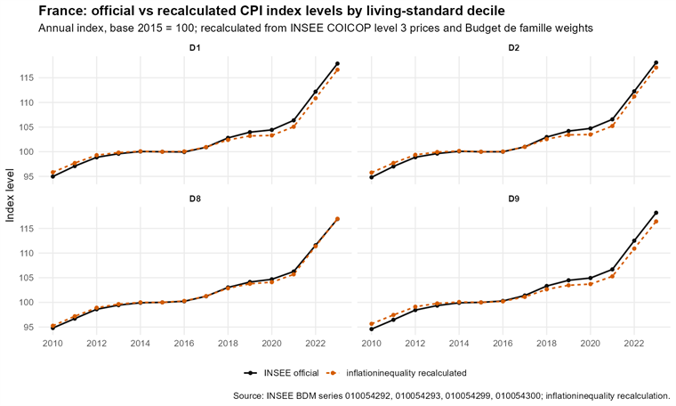

```{r, include = FALSE}
knitr::opts_chunk$set(
  collapse = TRUE,
  comment = "#>",
  echo = FALSE,
  eval = FALSE,
  warning = FALSE,
  message = FALSE,
  fig.width = 8,
  fig.height = 5
)
```

```{r setup, include = FALSE, eval = TRUE}
library(inflationinequality)
```

This vignette shows how to validate the package calculations against published
all-items HICP / CPI series.

The validation has two complementary goals:

1. Check that the package average across household groups tracks the published
   all-items inflation rate or index level.
2. For France, compare the package's INSEE level-3 decile calculations with
   official INSEE series by standard-of-living decile.

The examples below are reproducible. Some of them download data from Eurostat or
INSEE, so the vignette displays validation outputs and precomputed figures while
keeping the regeneration code in the source `.Rmd` file.

***

## RAS aggregation identity

The examples below use `weighting_method = "ras"` for income quintiles. This
calibrates the group-specific expenditure matrix so that each quintile basket
sums to 100 percent and the simple average of the five quintile baskets
reproduces the matched official HICP item weights.

The exact validation test is performed at the linear aggregation step. The
package first unchains item-level HICP indices, aggregates these elementary
monthly movements with group-specific weights, and then chain-links the
resulting series. Under RAS calibration, the simple average of the five
quintile-specific unchained Laspeyres movements is exactly equal to the
corresponding `"Total"` movement computed on the same matched COICOP field.

```{r ras-identity-code}
indices_ras <- calculate_price_indices(
  "FR",
  "income",
  level = 2,
  start_year = 2019,
  end_year = 2026,
  end_month = 4,
  base_year = 2015,
  include_total = TRUE,
  weighting_method = "ras"
)

quintile_mean <- indices_ras$dt[
  category != "Total",
  .(mean_quintile_laspeyres = mean(laspeyres)),
  by = .(year, month, date)
]

total_laspeyres <- indices_ras$dt[
  category == "Total",
  .(year, month, date, total_laspeyres = laspeyres)
]

ras_identity <- merge(
  quintile_mean,
  total_laspeyres,
  by = c("year", "month", "date")
)
ras_identity[, difference := mean_quintile_laspeyres - total_laspeyres]

ras_identity[
  ,
  .(
    max_abs_difference = max(abs(difference), na.rm = TRUE),
    april_2026_difference = difference[year == 2026 & month == 4]
  )
]
```

| Statistic | Difference |
|---|---:|
| Maximum absolute difference | \(9.565682 \times 10^{-13}\) |
| April 2026 difference | \(2.708944 \times 10^{-14}\) |

The maximum absolute difference is of the order of \(10^{-12}\), i.e. numerical
rounding error. This is the no-gap validation implied by the RAS constraint.

## Published all-items HICP diagnostic

The helper `compare_to_official_hicp()` compares a package calculation with the
published all-items HICP basket. With an `inflation` object it validates
year-on-year rates. With a `price_indices` object it validates index levels.
This is an external diagnostic, not the RAS identity itself: the official
published all-items series may use a broader product field, a different
ECOICOP version, and a direct chain-linked aggregate.

```{r hicp-rate-code}
inflation <- calculate_inflation(
  "FR",
  "income",
  level = 2,
  start_year = 2019,
  end_year = 2026,
  end_month = 4,
  weighting_method = "ras"
)

comparison <- compare_to_official_hicp(inflation)
comparison$summary
comparison$plot
```

```{r hicp-rate-figure, echo = FALSE, eval = TRUE, out.width = "100%"}
knitr::include_graphics("figures/france_hicp_validation_mean_vs_published.png")
```

For index levels, use `calculate_price_indices()` first. The published HICP is
rebased to the same base year before comparison.

```{r hicp-level-code}
indices <- calculate_price_indices(
  "FR",
  "income",
  level = 2,
  start_year = 2010,
  end_year = 2026,
  end_month = 4,
  base_year = 2015,
  weighting_method = "ras"
)

level_comparison <- compare_to_official_hicp(indices)
level_comparison$summary
level_comparison$plot
```

```{r hicp-level-figure, echo = FALSE, eval = TRUE, out.width = "100%"}
knitr::include_graphics("figures/france_hicp_validation_level_mean_vs_published.png")
```

Differences in these figures should therefore be interpreted as residual
differences between the package reconstruction and the published aggregate, not
as a failure of the RAS aggregation identity shown above.

### Euro-area aggregate validation

For euro-area calculations, the validation is slightly different. The package
first calculates national unchained monthly movements, then aggregates these
movements with Eurostat HICP country weights before chain-linking and rebasing
the euro-area index. To isolate this aggregation step, the diagnostic below uses
the recalculated `"Total"` category for `EA20`: this is the country-weighted
average of each country's all-items HICP-style total. It is not the average of
the Q1-to-Q5 household-group indices, nor the country-weighted average of those
within-country quintile averages.

The comparison covers January 2015 to April 2026. Both the recalculated `EA20`
total and the official Eurostat all-items HICP are expressed with base
2025 = 100. Over the 136 monthly observations, the mean difference is
0.031 index point, the mean absolute difference is 0.162 index point, the RMSE
is 0.205 index point, and the maximum absolute difference is 0.571 index point.
This shows that the euro-area aggregation used by the package is very close to
the published EA20 HICP, while still leaving small differences due to COICOP
coverage, ECOICOP mapping, and the use of annual country weights.

```{r ea20-hicp-level-code}
indices_ea20 <- calculate_price_indices(
  "EA20",
  "income",
  start_year = 2015,
  end_year = 2026,
  end_month = 4,
  base_year = 2025,
  include_total = TRUE
)

ea20_total <- indices_ea20$dt[
  category == "Total",
  .(year, month, date, calculated_value = price_index)
]

official_ea20 <- load_cpi(
  "EA20",
  level = 2,
  start_year = 2015,
  end_year = 2026,
  end_month = 4
)

official_ea20_total <- official_ea20$dt_basket[
  ,
  .(
    year,
    month,
    date = as.Date(sprintf("%04d-%02d-01", year, month)),
    official_value = hicp::rebase(
      value,
      t = as.Date(sprintf("%04d-%02d-01", year, month)),
      t.ref = "2025"
    )
  )
]

ea20_comparison <- merge(
  ea20_total,
  official_ea20_total,
  by = c("year", "month", "date"),
  all.x = TRUE
)
ea20_comparison[, difference := calculated_value - official_value]

ea20_comparison[
  !is.na(calculated_value) & !is.na(official_value),
  .(
    n = .N,
    mean_difference = mean(difference),
    mean_abs_difference = mean(abs(difference)),
    rmse = sqrt(mean(difference^2)),
    max_abs_difference = max(abs(difference))
  )
]
```

```{r ea20-hicp-level-figure, echo = FALSE, eval = TRUE, out.width = "100%"}
knitr::include_graphics("figures/ea20_hicp_validation_total_vs_official_2015_2026_04.png")
```

## France INSEE level-3 validation

France is the first country in the package with a national-source level-3
workflow. The custom INSEE workflow uses:

- monthly CPI product indices from INSEE, COICOP level 3;
- annual CPI item weights from INSEE;
- INSEE Budget de famille 2017 expenditure by standard-of-living decile.

```{r insee-level3-data}
cpi_level3 <- readRDS("articles/INSEE_CPI_level3.RDS")
index_weights_level3 <- readRDS("articles/INSEE_CPI_index_weights_level3.RDS")
hbs_level3 <- readRDS("articles/INSEE_HBS_2017_level3.RDS")

inflation_insee_level3 <- calculate_inflation(
  "FR",
  "income",
  level = 3,
  start_year = 2019,
  custom_cpi = cpi_level3,
  custom_index_weights = index_weights_level3,
  custom_hbs = hbs_level3
)

plot_time_series(inflation_insee_level3)
```

### Annual inflation by decile

INSEE publishes annual CPI series by standard-of-living decile. The package can
be compared with these series by annualising the calculated monthly inflation
rates.

```{r insee-annual-decile-code}
published_decile_inflation <- readRDS("articles/INSEE_inflation_income_dt.RDS")

calculated_decile_inflation <- inflation_insee_level3$dt[
  ,
  .(calculated_inflation = mean(inflation, na.rm = TRUE)),
  by = .(year, category)
]

decile_comparison <- published_decile_inflation[
  calculated_decile_inflation,
  on = .(year, category),
  nomatch = NULL
][
  ,
  difference := calculated_inflation - headline_inflation
]

decile_comparison[
  ,
  .(
    mean_difference = mean(difference, na.rm = TRUE),
    mean_abs_difference = mean(abs(difference), na.rm = TRUE),
    max_abs_difference = max(abs(difference), na.rm = TRUE)
  ),
  by = category
]
```

```{r insee-decile-rate-figure, echo = FALSE, eval = TRUE, out.width = "100%"}
knitr::include_graphics("../man/figures/france-insee-decile-published-vs-recalculated-D1-D2-D8-D9.png")
```

### Index levels by decile

Annual inflation rates are useful, but the more direct validation is to compare
index levels. The figure below compares INSEE official annual index levels with
the package recalculation for D1, D2, D8 and D9. Both series are expressed with
base 2015 = 100.

The official INSEE BDM idBank series are:

- D1: `010054292`
- D2: `010054293`
- D8: `010054299`
- D9: `010054300`

```{r insee-decile-index-figure, echo = FALSE, eval = TRUE, out.width = "100%"}

```
