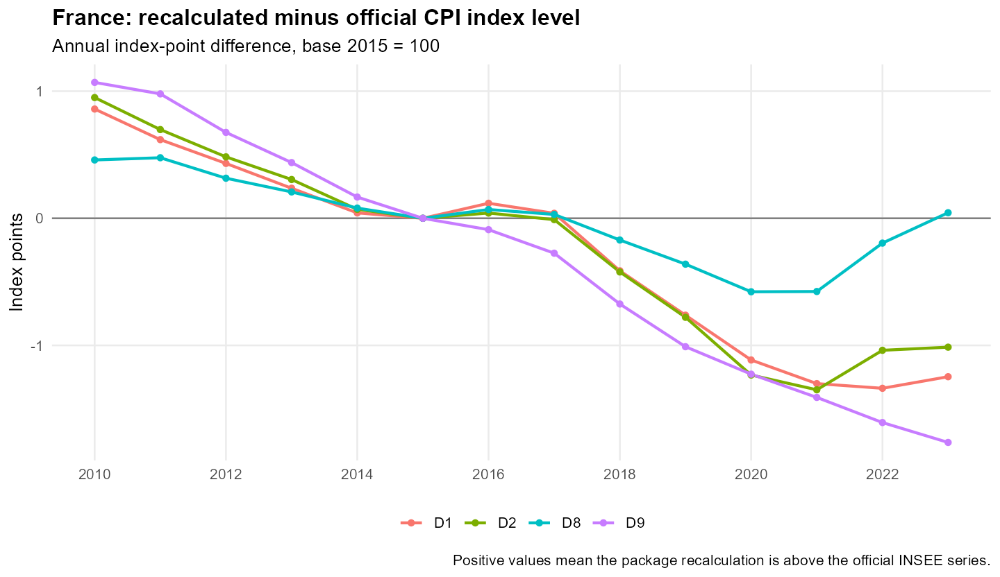

```{r, include = FALSE}
knitr::opts_chunk$set(
  collapse = TRUE,
  comment = "#>",
  eval = FALSE,
  warning = FALSE,
  message = FALSE,
  fig.width = 8,
  fig.height = 5
)
```

```{r setup, include = FALSE, eval = TRUE}
library(inflationinequality)
options(rdbnomics.use_readLines = TRUE)
```

This vignette shows how to validate the package calculations against published
all-items HICP / CPI series.

The validation has two complementary goals:

1. Check that the package average across household groups tracks the published
   all-items inflation rate or index level.
2. For France, compare the package's INSEE level-3 decile calculations with
   official INSEE series by standard-of-living decile.

The examples below are reproducible. Some of them download data from Eurostat or
INSEE, so the vignette displays precomputed figures and keeps the full
regeneration code visible.

***

## All-items HICP validation

The helper `compare_to_official_hicp()` compares a package calculation with the
published all-items HICP basket. With an `inflation` object it validates
year-on-year rates. With a `price_indices` object it validates index levels.

```{r hicp-rate-code}
inflation <- calculate_inflation(
  "FR",
  "income",
  start_year = 2019,
  end_year = 2026,
  end_month = 3
)

comparison <- compare_to_official_hicp(inflation)
comparison$summary
comparison$plot
```

```{r hicp-rate-figure, echo = FALSE, eval = TRUE, out.width = "100%"}
knitr::include_graphics("../docs/france_hicp_validation_mean_vs_published.png")
```

For index levels, use `calculate_price_indices()` first. The published HICP is
rebased to the same base year before comparison.

```{r hicp-level-code}
indices <- calculate_price_indices(
  "FR",
  "income",
  start_year = 2010,
  end_year = 2026,
  end_month = 3,
  base_year = 2010
)

level_comparison <- compare_to_official_hicp(indices)
level_comparison$summary
level_comparison$plot
```

```{r hicp-level-figure, echo = FALSE, eval = TRUE, out.width = "100%"}
knitr::include_graphics("../docs/france_hicp_validation_level_mean_vs_published.png")
```

These diagnostics should not be interpreted as an exact identity check. The
package calculates group-specific baskets from HBS expenditure patterns and then
averages the group indices, while the official all-items HICP uses the official
national aggregate basket directly. Small differences are therefore expected.

## France INSEE level-3 validation

France is the first country in the package with a national-source level-3
workflow. The custom INSEE workflow uses:

- monthly CPI product indices from INSEE, COICOP level 3;
- annual CPI item weights from INSEE;
- INSEE Budget de famille 2017 expenditure by standard-of-living decile.

```{r insee-level3-data}
cpi_level3 <- readRDS("articles/INSEE_CPI_level3.RDS")
index_weights_level3 <- readRDS("articles/INSEE_CPI_index_weights_level3.RDS")
hbs_level3 <- readRDS("articles/INSEE_HBS_2017_level3.RDS")

inflation_insee_level3 <- calculate_inflation(
  "FR",
  "income",
  level = 3,
  start_year = 2019,
  custom_cpi = cpi_level3,
  custom_index_weights = index_weights_level3,
  custom_hbs = hbs_level3
)

plot_time_series(inflation_insee_level3)
```

### Annual inflation by decile

INSEE publishes annual CPI series by standard-of-living decile. The package can
be compared with these series by annualising the calculated monthly inflation
rates.

```{r insee-annual-decile-code}
published_decile_inflation <- readRDS("articles/INSEE_inflation_income_dt.RDS")

calculated_decile_inflation <- inflation_insee_level3$dt[
  ,
  .(calculated_inflation = mean(inflation, na.rm = TRUE)),
  by = .(year, category)
]

decile_comparison <- published_decile_inflation[
  calculated_decile_inflation,
  on = .(year, category),
  nomatch = NULL
][
  ,
  difference := calculated_inflation - headline_inflation
]

decile_comparison[
  ,
  .(
    mean_difference = mean(difference, na.rm = TRUE),
    mean_abs_difference = mean(abs(difference), na.rm = TRUE),
    max_abs_difference = max(abs(difference), na.rm = TRUE)
  ),
  by = category
]
```

```{r insee-decile-rate-figure, echo = FALSE, eval = TRUE, out.width = "100%"}
knitr::include_graphics("../man/figures/france-insee-decile-published-vs-recalculated-D1-D2-D8-D9.png")
```

### Index levels by decile

Annual inflation rates are useful, but the more direct validation is to compare
index levels. The figure below compares INSEE official annual index levels with
the package recalculation for D1, D2, D8 and D9. Both series are expressed with
base 2015 = 100.

The official INSEE BDM idBank series are:

- D1: `010054292`
- D2: `010054293`
- D8: `010054299`
- D9: `010054300`

```{r insee-decile-index-code}
# Full regeneration script:
source("../scripts/plot_fr_decile_index_level_validation.R")
```

```{r insee-decile-index-figure, echo = FALSE, eval = TRUE, out.width = "100%"}
knitr::include_graphics("../man/figures/france-insee-decile-official-vs-recalculated-index-level-D1-D2-D8-D9-2010-2023.png")
```

The index-level gap plot is often easier to read when auditing small validation
differences.

```{r insee-decile-index-gap-figure, echo = FALSE, eval = TRUE, out.width = "100%"}

```

The current validation shows that the recalculated series closely tracks the
official INSEE levels. Differences are largest for D9 in the later years, which
is consistent with the sensitivity of high-income baskets to housing, transport,
and detailed COICOP bridge choices.

## Regenerating the figures

The figures shown in this vignette are regenerated by these scripts:

```{r regeneration-commands}
source("../scripts/plot_fr_hicp_validation.R")
source("../scripts/plot_fr_decile_index_level_validation.R")
```

The first script creates the all-items HICP validation charts in `docs/`. The
second script creates the INSEE decile index-level validation charts and CSV in
`man/figures/`.
